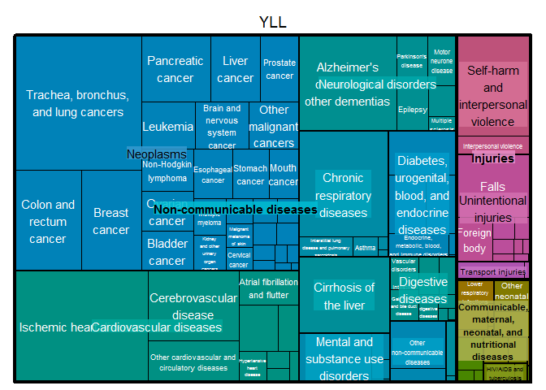

BeBOD / STANDARD EXPECTED YEARS OF LIFE LOST
================
Bdevleesschauwer
Mon Sep 24 16:07:10 2018

## COD data

``` r
## description
nrow(mrt)
```

    ## [1] 9329

``` r
range(mrt$AGE)
```

    ## [1]   0 107

``` r
## if 'ucause' not available, impute 'icd'
id <- mrt$ucause == ""
mrt[id, "ucause"] <- mrt[id, "icd"] 

## calculate YLLs
mrt$YLL <- rle(mrt$AGE)
sum(is.na(mrt$AGE))  # should be 0
```

    ## [1] 0

``` r
sum(is.na(mrt$YLL))  # should be 0
```

    ## [1] 0

``` r
## create dataframe
df <-
  data.frame(Freq = tapply(mrt$ucause, mrt$ucause, length),
             YLL = tapply(mrt$YLL, mrt$ucause, sum, na.rm = TRUE))

## tabulate ICD codes
datatable(
  round(df),
  options = list(
    pageLength = 20,
    lengthMenu = c(20, 100, 100, 2000))
)
```

<!--html_preserve-->

<div id="htmlwidget-ece38631eaf4f1ecdc75" class="datatables html-widget" style="width:100%;height:auto;">

</div>

<script type="application/json" data-for="htmlwidget-ece38631eaf4f1ecdc75">{"x":{"filter":"none","data":[["A021","A047","A090","A099","A162","A178","A199","A402","A403","A410","A414","A415","A419","A46","A498","A499","A810","A819","B002","B004","B012","B023","B029","B159","B171","B181","B182","B207","B208","B220","B227","B232","B24","B441","B449","B59","B909","B99","C01","C029","C049","C052","C069","C07","C089","C099","C109","C119","C12","C139","C140","C153","C155","C159","C160","C164","C169","C170","C179","C180","C181","C183","C184","C186","C187","C189","C19","C20","C210","C211","C218","C220","C221","C223","C229","C23","C241","C249","C250","C253","C259","C260","C268","C269","C300","C319","C320","C321","C322","C329","C33","C340","C341","C343","C349","C37","C380","C383","C384","C419","C435","C437","C439","C443","C445","C447","C449","C450","C459","C469","C482","C492","C494","C495","C499","C509","C539","C541","C55","C56","C570","C579","C61","C629","C64","C65","C66","C679","C689","C699","C709","C712","C714","C716","C717","C718","C719","C73","C749","C759","C760","C762","C800","C809","C819","C829","C831","C833","C837","C849","C851","C857","C859","C865","C880","C900","C910","C911","C919","C920","C921","C931","C937","C950","C959","C969","D126","D129","D180","D181","D303","D320","D329","D352","D353","D370","D374","D376","D377","D381","D390","D391","D414","D432","D446","D45","D462","D469","D471","D472","D473","D474","D479","D485","D486","D487","D510","D571","D580","D619","D649","D685","D689","D70","D728","D758","D860","D869","E039","E049","E050","E059","E079","E100","E102","E105","E107","E109","E112","E114","E115","E116","E117","E118","E119","E140","E141","E142","E145","E146","E147","E148","E149","E41","E46","E512","E662","E668","E669","E722","E780","E789","E835","E854","E858","E86","E870","E871","E872","E875","E876","E878","E888","E889","F011","F019","F03","F051","F067","F101","F102","F106","F107","F112","F131","F179","F191","F192","F200","F209","F220","F29","F314","F322","F329","F333","F341","F500","F54","F99","G00","G001","G039","G049","G060","G09","G10","G12","G121","G122","G128","G20","G214","G231","G238","G249","G259","G301","G309","G31","G310","G318","G319","G35","G372","G379","G409","G419","G459","G473","G60","G600","G610","G629","G700","G710","G711","G719","G809","G819","G822","G825","G903","G931","G936","G939","G950","G952","G959","G98","H549","I019","I050","I058","I059","I071","I080","I081","I082","I083","I10","I110","I119","I120","I130","I131","I132","I200","I209","I210","I211","I219","I248","I249","I250","I251","I253","I255","I258","I259","I269","I279","I319","I330","I340","I350","I351","I358","I359","I38","I40","I420","I422","I424","I425","I426","I428","I429","I442","I443","I447","I451","I455","I461","I469","I47","I471","I472","I489","I490","I494","I495","I498","I499","I500","I501","I509","I513","I514","I515","I516","I517","I518","I519","I600","I601","I608","I609","I611","I613","I614","I615","I618","I619","I620","I629","I630","I632","I633","I634","I635","I638","I639","I64","I671","I672","I675","I678","I679","I691","I694","I702","I709","I710","I711","I712","I713","I714","I715","I718","I719","I720","I724","I729","I739","I740","I741","I743","I745","I749","I772","I776","I779","I802","I809","I81","I829","I832","I839","I850","I871","I872","I890","I959","J069","J110","J111","J13","J14","J150","J151","J152","J159","J180","J181","J182","J188","J189","J208","J209","J22","J329","J398","J40","J42","J439","J440","J441","J448","J449","J459","J47","J60","J61","J679","J690","J81","J841","J849","J851","J852","J860","J869","J90","J939","J940","J96","J960","J961","J969","J980","J981","J982","J984","J985","J986","J989","K20","K220","K221","K222","K225","K229","K254","K255","K256","K264","K265","K275","K318","K352","K400","K409","K439","K440","K449","K460","K509","K510","K519","K529","K550","K551","K559","K560","K562","K563","K564","K565","K566","K567","K572","K578","K579","K625","K628","K631","K632","K638","K639","K649","K650","K658","K659","K661","K668","K701","K703","K704","K709","K716","K720","K729","K743","K745","K746","K750","K761","K767","K768","K769","K800","K802","K803","K805","K818","K819","K821","K822","K823","K828","K829","K830","K831","K839","K851","K852","K859","K860","K861","K868","K920","K921","K922","K928","K929","L021","L022","L024","L029","L031","L039","L089","L120","L88","L892","L899","L97","L984","M069","M139","M159","M169","M199","M259","M300","M310","M313","M314","M316","M321","M348","M349","M350","M464","M471","M480","M485","M512","M549","M625","M628","M629","M711","M726","M790","M809","M819","M844","M859","M869","M889","M898","N028","N12","N133","N179","N184","N185","N19","N200","N280","N289","N309","N321","N323","N329","N390","N40","N410","N419","N429","N492","N498","N768","N823","N824","N939","O881","P00","P01","P02","P22","P27","P36","P52","P60","P61","P70","P77","P78","Q049","Q20","Q203","Q21","Q213","Q24","Q25","Q26","Q60","Q61","Q850","Q87","Q878","Q909","Q91","R042","R048","R090","R092","R100","R11","R13","R263","R296","R31","R402","R468","R53","R54","R55","R570","R579","R58","R64","R688","R95","R960","R961","R98","R99","V021","V031","V040","V041","V051","V184","V234","V239","V299","V494","V498","V499","V892","V899","W06","W10","W13","W138","W14","W178","W18","W189","W19","W190","W199","W44","W54","W65","W66","W69","W74","W76","W77","W78","W79","W791","W799","W80","W84","X00","X30","X31","X42","X44","X45","X47","X49","X509","X590","X599","X61","X64","X65","X67","X70","X700","X708","X709","X71","X73","X74","X76","X78","X80","X81","X83","X84","X85","X91","X95","X950","X958","X99","Y01","Y04","Y07","Y09","Y11","Y12","Y14","Y20","Y21","Y30","Y34","Y524","Y712","Y792","Y83","Y831","Y839","Y842","Y859","Y86"],[1,14,4,28,1,1,1,1,2,2,1,5,61,4,2,1,3,1,1,2,1,2,1,1,15,2,4,1,1,1,2,1,2,3,1,1,4,13,6,10,7,1,5,2,1,3,5,1,4,2,6,1,5,46,3,1,51,6,2,6,1,1,2,1,17,149,18,37,3,6,1,38,37,1,18,4,5,5,11,1,132,6,2,11,1,1,6,3,1,7,1,2,10,10,434,3,1,2,4,4,1,1,16,4,2,1,6,2,5,1,3,4,1,1,8,187,12,15,10,51,1,5,113,2,35,1,2,80,27,3,1,3,1,1,1,2,36,6,5,6,16,4,118,1,6,1,4,8,2,1,8,2,35,1,4,35,5,14,2,33,4,1,1,15,12,1,1,1,2,1,1,1,2,1,1,2,5,1,8,9,1,1,3,7,1,2,2,25,4,3,1,1,1,1,1,3,1,1,1,2,17,1,2,1,1,1,1,2,3,1,3,3,1,1,5,1,1,4,17,1,3,1,6,2,28,2,1,13,3,2,8,2,50,1,58,2,1,3,8,1,1,1,1,3,2,22,7,2,2,2,1,4,1,3,1,54,305,1,8,2,48,6,1,1,1,1,1,3,1,3,1,1,1,1,18,1,1,1,1,5,1,1,1,1,1,2,3,1,1,22,1,81,1,4,1,1,1,8,256,1,13,12,10,12,1,1,24,4,4,2,1,3,1,3,3,2,3,1,2,4,1,4,2,7,1,2,2,1,3,4,1,1,1,1,3,2,7,1,1,1,53,42,13,25,1,2,11,3,7,15,14,296,4,14,1,39,1,79,4,152,49,9,2,10,11,75,5,2,14,22,1,15,1,2,1,1,1,18,1,1,1,1,2,6,119,1,3,4,142,10,1,1,2,66,15,24,252,1,1,1,12,5,2,29,1,1,5,18,3,5,2,4,4,93,20,4,1,5,3,2,3,1,48,263,3,3,1,9,4,3,31,2,13,9,5,2,7,3,1,3,1,1,1,4,10,2,1,7,1,1,1,15,4,6,1,1,2,1,1,1,1,1,2,2,1,10,11,8,1,1,1,3,2,55,27,6,1,191,1,3,28,1,1,42,11,22,104,30,15,172,22,4,2,2,1,77,7,33,1,1,2,1,5,3,3,1,1,4,8,18,10,2,1,11,1,1,3,2,1,1,2,2,1,2,5,1,3,1,1,2,1,1,1,1,1,3,2,1,1,2,1,17,1,26,1,1,1,3,1,31,2,1,5,1,4,1,11,1,2,2,1,3,2,4,2,2,7,56,1,1,1,2,8,1,1,63,1,1,2,1,4,1,4,2,1,1,4,1,1,1,1,4,5,1,2,1,2,8,2,1,1,3,2,31,1,2,1,1,2,1,2,2,7,3,1,4,13,1,1,4,1,3,1,2,5,1,1,3,1,2,2,1,1,1,2,1,1,2,1,2,1,2,1,1,1,1,1,1,1,1,7,1,1,1,42,2,11,1,54,20,1,1,1,1,1,1,1,47,4,1,3,1,1,1,1,2,1,1,1,1,1,6,2,1,1,1,1,1,1,1,1,1,3,1,1,2,1,2,1,1,1,1,1,1,1,1,1,1,7,189,1,2,1,1,1,1,1,1,59,125,2,2,4,1,8,15,2,6,1,28,415,1,4,1,2,2,1,1,2,1,1,1,1,12,1,2,18,4,1,1,1,1,1,130,2,3,1,1,1,1,1,3,1,1,7,4,1,1,11,28,3,3,1,9,8,8,3,1,1,84,33,3,19,1,3,43,1,2,1,5,1,2,2,3,17,3,1,2,1,5,1,1,1,3,2,1,1,2,1,1,3,2,1,1,29,1,1,3,1,5,5,1,1,2],[22,122,72,351,24,45,17,8,39,21,5,40,802,22,20,3,57,7,86,28,19,13,5,9,335,61,64,32,38,24,69,57,83,82,12,28,44,82,149,211,201,19,143,38,17,73,151,37,100,40,117,19,106,928,39,4,930,73,30,56,5,8,12,4,216,2143,278,710,35,108,8,823,734,22,241,77,93,111,130,10,2370,123,44,150,58,9,76,62,33,152,17,60,179,182,8671,81,15,28,71,63,10,32,309,74,20,23,62,42,76,11,103,62,15,9,130,3256,337,282,183,1101,30,46,1398,72,611,5,37,1092,377,65,37,60,11,24,19,92,987,121,150,159,405,41,1880,40,113,29,52,190,83,19,124,36,643,10,63,577,64,137,10,641,88,8,12,180,231,12,5,21,22,9,2,4,21,62,43,33,39,5,77,99,4,17,18,104,14,21,20,222,33,21,11,26,26,4,3,19,8,63,17,11,113,45,35,22,21,10,27,77,33,4,19,40,12,43,54,14,5,96,144,14,31,22,107,42,340,42,10,142,28,12,93,45,663,4,476,56,10,108,202,8,4,4,42,27,12,150,61,6,11,15,10,27,86,18,10,394,2161,6,44,61,1307,132,44,42,17,36,43,141,19,125,24,26,10,6,201,9,6,31,35,74,87,86,15,8,30,46,96,87,85,388,12,828,10,77,73,19,14,48,2051,87,141,110,111,224,33,17,727,51,45,40,87,59,30,43,36,126,57,35,149,46,14,88,11,178,67,46,44,19,27,69,5,20,16,23,36,25,66,4,7,12,664,326,130,202,14,14,102,36,36,246,210,4112,21,184,10,522,6,917,39,1666,710,78,15,176,107,609,26,8,152,200,87,394,8,59,4,17,21,189,6,7,5,14,7,126,1371,87,53,64,1114,207,7,13,19,799,106,210,2057,31,86,15,120,81,20,336,26,31,125,440,24,141,85,51,25,1175,221,60,8,32,36,33,20,11,517,2488,45,15,44,143,31,25,253,27,146,175,43,33,98,31,27,112,7,6,7,100,130,37,10,78,15,5,23,149,31,74,8,13,46,37,7,19,27,10,22,11,2,98,63,109,70,6,77,47,18,423,226,28,5,1775,4,12,315,8,10,327,132,332,1314,429,174,2347,282,37,22,18,15,682,71,465,16,9,26,10,61,21,41,20,87,30,114,245,123,27,26,167,51,16,54,14,9,15,26,9,7,18,55,10,20,4,5,21,8,6,6,7,8,18,30,15,4,9,27,171,12,316,12,11,11,37,5,334,17,7,48,5,48,10,208,16,28,25,15,75,73,77,31,37,207,1649,26,21,20,106,179,16,20,1390,20,11,31,10,81,10,23,18,6,38,36,33,7,11,10,120,104,13,65,7,60,176,41,37,28,54,13,482,12,39,6,10,27,12,9,25,86,18,14,33,137,11,9,37,14,10,11,20,48,7,5,23,56,22,41,26,19,10,34,11,24,25,5,15,40,15,43,11,16,14,4,6,9,7,75,6,2,9,411,25,132,3,493,247,8,17,13,3,4,15,3,404,25,4,48,23,29,7,12,10,7,6,49,87,87,520,173,87,87,87,87,87,87,87,87,80,260,85,87,101,87,173,87,87,87,19,87,86,34,87,10,8,100,2129,21,29,6,7,4,9,23,19,471,647,68,11,24,40,55,104,173,89,4,562,8096,77,181,30,26,65,43,62,76,33,69,24,56,448,13,15,336,92,58,65,30,9,5,1818,38,26,10,10,8,8,35,137,57,52,209,85,11,20,134,395,59,28,42,461,315,361,169,16,38,528,715,120,621,36,143,1781,47,103,38,177,10,73,84,123,517,77,35,64,42,216,45,61,54,144,58,35,87,54,41,33,120,100,67,58,1059,12,29,36,87,30,35,15,62,33]],"container":"<table class=\"display\">\n  <thead>\n    <tr>\n      <th> <\/th>\n      <th>Freq<\/th>\n      <th>YLL<\/th>\n    <\/tr>\n  <\/thead>\n<\/table>","options":{"pageLength":20,"lengthMenu":[20,100,100,2000],"columnDefs":[{"className":"dt-right","targets":[1,2]},{"orderable":false,"targets":0}],"order":[],"autoWidth":false,"orderClasses":false}},"evals":[],"jsHooks":[]}</script>

<!--/html_preserve-->

## GBD causes

``` r
## read GBD cause list
gbd <-
  suppressWarnings(
    readxl("../03_data/master_cause_list-may-08-2014-Just ICD10.xlsx"))
str(gbd)
```

    ## 'data.frame':    41548 obs. of  12 variables:
    ##  $ icd_level        : num  3 4 4 4 3 4 5 5 5 5 ...
    ##  $ icd_code         : chr  "A00" "A00.0" "A00.1" "A00.9" ...
    ##  $ X__1             : chr  "A00" "A000" "A001" "A009" ...
    ##  $ icd_name         : chr  "Cholera" "Cholera due to Vibrio cholerae 01, biovar cholerae" "Cholera due to Vibrio cholerae 01, biovar eltor" "Cholera, unspecified" ...
    ##  $ yll_cause        : chr  "diarrhea_cholera" "diarrhea_cholera" "diarrhea_cholera" "diarrhea_cholera" ...
    ##  $ yll_cause_name   : chr  "Cholera" "Cholera" "Cholera" "Cholera" ...
    ##  $ yll_gc_type      : chr  NA NA NA NA ...
    ##  $ yll_rdp          : chr  NA NA NA NA ...
    ##  $ yld_cause        : chr  "diarrhea_cholera" "diarrhea_cholera" "diarrhea_cholera" "diarrhea_cholera" ...
    ##  $ yld_cause_name   : chr  "Cholera" "Cholera" "Cholera" "Cholera" ...
    ##  $ yld_gc_type      : chr  NA NA NA NA ...
    ##  $ yld_gc_short_name: logi  NA NA NA NA NA NA ...

``` r
## map to GBD cause list
in_gbd <- mrt$ucause %in% gbd$X__1
table(in_gbd)
```

    ## in_gbd
    ## TRUE 
    ## 9329

``` r
sort(table(mrt$ucause[!in_gbd]))
```

    ## integer(0)

``` r
## drop 4th level code from non-mapped causes
mrt$ucause2 <- mrt$ucause
mrt$ucause2[!in_gbd] <- substr(mrt$ucause2[!in_gbd], 1, 4)

## map to GBD cause list
in_gbd2 <- mrt$ucause2 %in% gbd$X__1
table(in_gbd2)
```

    ## in_gbd2
    ## TRUE 
    ## 9329

``` r
sort(table(mrt$ucause2[!in_gbd2]))
```

    ## integer(0)

``` r
## define GBD cause
mrt$gbdcause <- 
  gbd$yll_cause_name[match(mrt$ucause2, gbd$X__1)]
sum(is.na(mrt$gbdcause))
```

    ## [1] 0

``` r
sum(mrt$gbdcause == "Garbage code", na.rm = TRUE) / nrow(mrt)
```

    ## [1] 0.327795

``` r
sum(mrt$YLL[mrt$gbdcause == "Garbage code"], na.rm = TRUE) /
  sum(mrt$YLL, na.rm = TRUE)
```

    ## [1] 0.2895315

``` r
## create dataframe
dfgbd <-
  data.frame(Freq = tapply(mrt$gbdcause, mrt$gbdcause, length),
             YLL = tapply(mrt$YLL, mrt$gbdcause, sum, na.rm = TRUE))

## tabulate GBD causes 2013
datatable(
  round(dfgbd),
  options = list(
    pageLength = 20,
    lengthMenu = c(20, 50, 100, 200))
)
```

<!--html_preserve-->

<div id="htmlwidget-38ef92fc32a2c65f5300" class="datatables html-widget" style="width:100%;height:auto;">

</div>

<script type="application/json" data-for="htmlwidget-38ef92fc32a2c65f5300">{"x":{"filter":"none","data":[["Abscess, impetigo, and other bacterial skin diseases","Acute hepatitis A","Acute hepatitis C","Acute lymphoid leukemia","Acute myeloid leukemia","Adverse effects of medical treatment","Alcohol use disorders","Alzheimer's disease and other dementias","Anorexia nervosa","Aortic aneurysm","Aplastic anaemias","Appendicitis","Asbestosis","Assault by firearm","Assault by other means","Assault by sharp object","Asthma","Atrial fibrillation and flutter","Bladder cancer","Brain and nervous system benign, in situ, uncertain, or unknown behavior neoplasms","Brain and nervous system cancer","Breast cancer","Cancer of other part of pharynx and oropharynx","Cardiomyopathy and myocarditis","Cellulitis","Cervical cancer","Chromosomal unbalanced rearrangements","Chronic diseases of upper respiratory system","Chronic kidney disease due to diabetes mellitus","Chronic kidney disease due to hypertension","Chronic kidney disease due to other causes","Chronic kidney diseases","Chronic obstructive pulmonary disease","Cirrhosis of the liver","Clostridium difficile","Coal workers’ pneumoconiosis","Colon and rectum cancer","Congenital heart anomalies","Decubitus ulcer","Diabetes mellitus","Diverticular disease of intestine","Down's syndrome","Drowning","Encephalitis","Endocarditis","Environmental heat and cold exposure","Epilepsy","Esophageal cancer","Falls","Fire, heat and hot substances","Foreign body in other part of body","Gall bladder and bile duct disease","Gallbladder and biliary tract cancer","Garbage code","Gastroesophageal reflux disease","Guillain-Barre syndrome","H influenzae type B pneumonia","Hemorrhagic and other non-ischemic stroke","Hemorrhoids, anal fissure, anal abscess, and fistula","Herpes simplex infections","HIV disease resulting in other specified or unspecified diseases","HIV/AIDS","Hodgkin's disease","Hypertensive heart disease","Hyperthyroidism","Hypothyroidism","Inflammatory diseases of cervix, vagina, and vulva","Influenza","Inguinal or femoral hernia","Interstitial lung disease and pulmonary sarcoidosis","Iron-deficiency anemia","Ischemic heart disease","Ischemic stroke","Kidney and other urinary organ cancers","Larynx cancer","Leukemia","Lipoprotein metabolism and other lipidaemias disorders","Liver cancer","Malignant melanoma of skin","Mesothelioma","Motor neurone disease","Motorized vehicle with three or more wheels","Motorized vehicle with two wheels","Mouth cancer","Multiple myeloma","Multiple sclerosis","Nasopharynx cancer","Neonatal encephalopathy (birth asphyxia and birth trauma)","Non-Hodgkin lymphoma","Non-infective inflammatory bowel disease","Non-melanoma skin cancer","Non-venomous animal contact","Nonrheumatic valvular disorders","Obesity, generalized or localized","Opioid use disorders","Osteomyelitis non-traumatic","Other cardiovascular and circulatory diseases","Other chronic respiratory diseases","Other congenital anomalies","Other diarrheal diseases","Other digestive diseases","Other drug use disorders","Other endocrine, nutritional, blood, and immune disorders","Other hemoglobinopathies and hemolytic anemias","Other infectious diseases","Other lower respiratory infections","Other malignant cancers","Other maternal disorders","Other musculoskeletal disorders","Other neglected tropical diseases","Other neonatal disorders","Other neurological disorders","Other non-malignant neoplasms","Other nutritional deficiencies","Other salmonella infections","Other skin and subcutaneous diseases","Other transport injury","Other urinary diseases","Ovarian cancer","Pancreatic cancer","Pancreatitis","Paralytic ileus and intestinal obstruction without hernia","Parkinson's disease","Pedal cycle vehicle","Pedestrian injury by road vehicle","Peptic ulcer disease","Peripheral vascular disease","Phlebitis and thrombophlebitis","Pneumococcal meningitis","Pneumococcal pneumonia","Poisoning gases and vapors","Post procedural or drug treatment disorders due to procedure or medications","Preterm birth complications","Prostate cancer","Prostatitis and epididymitis","Protein-energy malnutrition","Pulmonary aspiration and foreign body in treachea or lung","Pyogenic and reactive arthritis","Rheumatic heart disease","Rheumatoid arthritis","Schizophrenia","Self-harm by fire, heat and hot substances","Self-harm by mechanical forces firearm","Self-harm by other specified means","Sepsis and other infectious disorders of the newborn baby","Sickle cell disorders","Sleep apnea","Stomach cancer","Subarachnoid hemorrhagic stroke","Sudden infant death syndrome","Systemic and discoid lupus erythematous","Testicular cancer","Thyroid cancer","Trachea, bronchus, and lung cancers","Tuberculosis","Tubulointerstitial nephritis, pyelonephritis, and urinary tract infections","Unintentional injuries not classified elsewhere","Unintentional suffocation","Urolithiasis","Uterine cancer","Varicella","Varicose veins of lower extremities and pelvic organs","Vascular disorders of intestine"],[19,1,15,19,38,17,65,660,1,31,2,1,2,3,10,3,22,142,84,10,45,188,14,54,4,12,1,1,35,39,1,55,400,151,14,2,244,11,17,116,7,1,6,1,10,4,28,52,164,3,1,29,14,3058,9,1,1,111,6,3,6,2,6,55,6,4,1,21,8,37,17,629,71,36,17,30,2,94,19,7,31,3,4,37,39,12,1,6,63,5,13,1,129,12,1,7,39,2,6,32,5,6,17,1,8,9,65,1,13,1,7,22,29,3,1,3,2,3,52,144,15,40,82,1,8,15,12,24,1,8,3,2,4,113,6,59,52,1,18,4,6,2,3,104,1,1,2,55,82,2,2,2,6,466,7,90,2,1,1,15,4,2,44],[195,9,335,202,737,244,1905,5112,31,525,11,8,18,160,437,144,282,1114,1113,129,1228,3260,364,998,34,337,87,8,340,332,9,496,5091,3765,122,22,3609,879,170,1607,60,34,188,8,176,70,778,1052,2492,59,10,491,281,39670,81,30,70,1501,73,114,220,83,113,456,59,37,12,161,68,586,113,8005,761,616,322,432,7,1819,356,119,789,149,171,816,640,224,37,520,1199,55,179,10,1103,321,42,75,587,25,444,423,70,217,327,17,158,146,1267,49,174,28,606,446,263,64,22,18,65,45,1118,2510,349,425,838,43,313,134,157,323,86,109,169,26,346,1398,88,480,854,11,210,37,194,84,83,3880,87,63,40,973,1167,173,41,72,121,9207,130,817,90,57,8,282,36,44,499]],"container":"<table class=\"display\">\n  <thead>\n    <tr>\n      <th> <\/th>\n      <th>Freq<\/th>\n      <th>YLL<\/th>\n    <\/tr>\n  <\/thead>\n<\/table>","options":{"pageLength":20,"lengthMenu":[20,50,100,200],"columnDefs":[{"className":"dt-right","targets":[1,2]},{"orderable":false,"targets":0}],"order":[],"autoWidth":false,"orderClasses":false}},"evals":[],"jsHooks":[]}</script>

<!--/html_preserve-->

``` r
## add cause names
dfgbd$cause4 <- rownames(dfgbd)
causelist <- readxl("../03_data/mastercauselist.xlsx")
str(causelist)
```

    ## 'data.frame':    197 obs. of  4 variables:
    ##  $ Level1: chr  "Non-communicable diseases" "Communicable, maternal, neonatal, and nutritional diseases" "Non-communicable diseases" "Non-communicable diseases" ...
    ##  $ Level2: chr  "Other non-communicable diseases" "Other communicable, maternal, neonatal, and nutritional diseases" "Neoplasms" "Neoplasms" ...
    ##  $ Level3: chr  "Skin and subcutaneous diseases" "Hepatitis" "Leukemia" "Leukemia" ...
    ##  $ Level4: chr  "Abscess, impetigo, and other bacterial skin diseases" "Acute hepatitis C" "Acute lymphoid leukemia" "Acute myeloid leukemia" ...

``` r
id <- dfgbd$cause4 %in% causelist$Level4
dfgbd$cause4[!id]
```

    ## [1] "Acute hepatitis A"                                        
    ## [2] "Preterm birth complications"                              
    ## [3] "Sepsis and other infectious disorders of the newborn baby"
    ## [4] "Sudden infant death syndrome"

``` r
dfgbd$cause3 <-
  causelist$Level3[match(dfgbd$cause4, causelist$Level4)]
dfgbd$cause2 <-
  causelist$Level2[match(dfgbd$cause4, causelist$Level4)]
dfgbd$cause1 <-
  causelist$Level1[match(dfgbd$cause4, causelist$Level4)]

write.csv2(dfgbd, file = "YLL-BXL.csv", row.names = FALSE)

treemap(subset(dfgbd, cause1 != "Garbage code"),
        index = c("cause1", "cause2", "cause3"),
        vSize = "YLL")
```

<!-- -->

## Garbage codes

``` r
## explore garbage codes
is_gc <- mrt$gbdcause == "Garbage code"
gc_tab <- sort(table(mrt$ucause2[is_gc]))
in_gbd <- match(names(sort(gc_tab)), gbd$X__1)

df_gc <-
  cbind(gbd[in_gbd, c("X__1", "icd_name", "yll_rdp")],
        c(gc_tab))
names(df_gc) <- c("ICD10", "ICD10 name", "RDP", "Freq")

datatable(
  df_gc,
  rownames = FALSE,
  options = list(
    pageLength = 20,
    lengthMenu = c(20, 50, 100, 200)))
```

<!--html_preserve-->

<div id="htmlwidget-83a068d9d1d9fca9aafc" class="datatables html-widget" style="width:100%;height:auto;">

</div>

<script type="application/json" data-for="htmlwidget-83a068d9d1d9fca9aafc">{"x":{"filter":"none","data":[["A402","A414","A499","C469","C809","D181","D376","D390","E079","E876","F051","F179","F314","F322","F333","F341","F54","G00","G039","G060","G60","G822","G936","H549","I442","I443","I447","I451","I494","I495","J069","J188","J851","J860","J940","J96","J982","J985","J986","K632","K716","K750","M139","M169","M471","M480","M512","M625","M629","M726","M790","M809","M819","M844","M859","N321","N329","N429","N824","N939","R042","R048","R100","R13","R263","R296","R31","R402","R468","R58","R961","V899","Y11","Y12","Y21","Y30","Y859","A403","A410","A498","C268","D180","D370","E871","E872","E875","G09","G809","G939","I455","I498","I518","I959","J159","J852","J981","K638","K639","K658","K661","K720","K921","K929","M199","M464","M485","M549","M628","N133","N823","R11","R55","R570","Y09","Y20","Y86","D487","G600","G629","J90","J939","J989","K650","K920","M159","Y14","C762","E878","G819","G825","G98","I629","I679","J960","K659","N40","R579","A415","C579","F99","I517","J869","M259","C140","C260","C759","I461","J182","R960","E870","G931","J81","R090","D377","F067","J961","R64","X44","I279","I678","X42","C55","I490","J980","C269","J984","K631","N179","V892","B99","I709","I500","R688","C760","F329","J969","N19","E86","I501","C689","J181","J22","R98","I519","Y34","K922","X599","I269","I10","J180","R53","A419","I499","J690","X590","C800","I469","R54","R092","J189","I509","I64","R99"],["Septicaemia due to streptococcus, group D","Sepsis due to anaerobes","Bacterial infection, unspecified","Kaposi's sarcoma, unspecified","Malignant neoplasm without specification of site","Hemangioma of skin and subcutaneous tissue","Neoplasm of uncertain behavior of liver, gallbladder and bile ducts","Neoplasm of uncertain behavior of uterus","Disorder of thyroid, unspecified","Hyperosmolality and hypernatraemia","Delirium superimposed on dementia","Ment/beh disrd dt tobacco w ment/beh NOS","Bipolar disorder, current episode depressed, severe, without psychotic features","Major depressive disorder, single episode, severe without psychotic features","Major depressive disorder, recurrent, severe with psychotic symptoms","Dysthymic disorder","Psychological and behavioral factors associated with disorders or diseases classified elsewhere","Bacterial meningitis, not elsewhere classified","Meningitis, unspecified","Intracranial abscess and granuloma","Hereditary and idiopathic neuropathy","Paraplegia","Cerebral edema",null,"Atrioventricular block, complete","Other and unspecified atrioventricular block","Left bundle-branch block, unspecified","Other and unspecified right bundle-branch block","Other and unspecified premature depolarization","Sick sinus syndrome","Acute upper respiratory infection, unspecified","Other pneumonia, unspecified organism","Abscess of lung with pneumonia","Pyothorax with fistula","Chylous effusion","Respiratory failure, not elsewhere classified","Interstitial emphysema","Diseases of mediastinum, not elsewhere classified","Disorders of diaphragm","Fistula of intestine","Toxic liver disease with hepatitis, not elsewhere classified","Abscess of liver","Arthritis, unspecified","Osteoarthritis of hip, unspecified","Anterior spinal artery compression syndromes","Spinal stenosis","Other thoracic, thoracolumbar and lumbosacral intervertebral disc displacement","Separation of muscle (nontraumatic), thigh","Disorder of muscle, unspecified","Necrotizing fasciitis","Rheumatism, unspecified","Unspecified osteoporosis with pathological fracture","Osteoporosis, unspecified",null,"Fibrous dysplasia (monostotic), multiple sites","Vesicointestinal fistula","Bladder disorder, unspecified","Disorder of prostate, unspecified","Other female intestinal-genital tract fistulae","Abnormal uterine and vaginal bleeding, unspecified","Hemoptysis","Hemorrhage from other sites in respiratory passages","Acute abdomen","Aphagia and dysphagia",null,"Repeated falls","Hematuria","Coma","Other symptoms and signs involving appearance and behavior","Hemorrhage, not elsewhere classified","Death occurring less than 24 hours from onset of symptoms, not otherwise explained","Person injured in unspecified vehicle accident, sequela","Poisoning by and exposure to antiepileptic, sedative-hypnotic, antiparkinsonism and psychotropic drugs, not elsewhere classified, undetermined intent","Poisoning by and exposure to narcotics and psychodysleptics [hallucinogens], not elsewhere classified, undetermined intent","Drowning and submersion, undetermined intent","Falling, jumping or pushed from a high place, undetermined intent","Sequelae of other and unspecified transport accidents","Sepsis due to Streptococcus pneumoniae","Sepsis due to Staphylococcus aureus","Other bacterial infections of unspecified site","Overlapping lesion of digestive system","Hemangioma","Neoplasm of uncertain behavior of lip, oral cavity and pharynx","Hyperosmolality and hypernatraemia","Hyperosmolality and hypernatraemia","Hyperosmolality and hypernatraemia","Sequelae of inflammatory diseases of central nervous system","Cerebral palsy, unspecified","Disorder of brain, unspecified","Other specified heart block","Other specified cardiac arrhythmias","Other ill-defined heart diseases","Hypotension, unspecified","Unspecified bacterial pneumonia","Abscess of lung without pneumonia","Acute bronchospasm","Other specified diseases of intestine","Disease of intestine, unspecified","Other peritonitis","Hemoperitoneum","Acute and subacute hepatic failure","Melena","Disease of digestive system, unspecified","Osteoarthritis, unspecified site","Spinal enthesopathy, thoracic region","Spinal stenosis, thoracolumbar region","Panniculitis affecting regions, neck and back, multiple sites in spine","Separation of muscle (nontraumatic), other site","Other and unspecified hydronephrosis","Fistula of vagina to large intestine","Nausea and vomiting","Syncope and collapse","Cardiogenic shock","Assault by unspecified means","Hanging, strangulation and suffocation, undetermined intent","Sequelae of other accidents","Neoplasm of uncertain behavior of other specified sites","Hereditary motor and sensory neuropathy","Polyneuropathy, unspecified","Pleural effusion, not elsewhere classified","Pneumothorax, unspecified","Other diseases of bronchus, not elsewhere classified","Generalized (acute) peritonitis","Hematemesis","Polyosteoarthritis, unspecified","Poisoning by and exposure to other and unspecified drugs, medicaments and biological substances, undetermined intent","Malignant neoplasm of abdomen","Hyperosmolality and hypernatraemia","Hemiplegia, unspecified","Quadriplegia","Other disorders of nervous system not elsewhere classified","Nontraumatic intracranial hemorrhage, unspecified","Cerebrovascular disease, unspecified","Acute respiratory failure","Peritonitis, unspecified","Enlarged prostate","Shock, unspecified","Sepsis due to other Gram-negative organisms","Malignant neoplasm of female genital organ, unspecified","Mental disorder, not otherwise specified","Cardiomegaly","Pyothorax without fistula","Joint disorder, unspecified","Malignant neoplasm of pharynx, unspecified","Malignant neoplasm of intestinal tract, part unspecified","Malignant neoplasm of endocrine gland, unspecified","Sudden cardiac death, so described","Hypostatic pneumonia, unspecified organism","Instantaneous death","Hyperosmolality and hypernatremia","Anoxic brain damage, not elsewhere classified","Pulmonary edema","Asphyxia and hypoxemia","Other digestive organs","Mild cognitive disorder","Acute respiratory failure with hypoxia","Cachexia","Accidental poisoning by and exposure to other and unspecified drugs, medicaments and biological substances","Pulmonary heart disease, unspecified","Other specified cerebrovascular diseases","Accidental poisoning by and exposure to narcotics and psychodysleptics [hallucinogens], not elsewhere classified","Malignant neoplasm of uterus, part unspecified","Ventricular fibrillation and flutter","Diseases of bronchus, not elsewhere classified","Malignant neoplasm of ill-defined sites within the digestive system","Other disorders of lung","Perforation of intestine (nontraumatic)","Acute kidney failure, unspecified","Person injured in unspecified motor-vehicle accident, traffic, sequela","Other and unspecified infectious diseases","Other and unspecified atherosclerosis","Congestive heart failure","Other general symptoms and signs","Malignant neoplasm of head, face and neck","Major depressive disorder, single episode, unspecified","Respiratory failure, unspecified","Unspecified kidney failure","Volume depletion","Left ventricular failure","Malignant neoplasm of urinary organ, unspecified","Lobar pneumonia, unspecified organism","Unspecified acute lower respiratory infection","Unattended death","Heart disease, unspecified","Unspecified event, undetermined intent","Gastrointestinal hemorrhage, unspecified","Exposure to unspecified factor causing other and unspecified injury","Other pulmonary embolism with acute cor pulmonale","Essential (primary) hypertension","Bronchopneumonia, unspecified organism","Malaise and fatigue","Sepsis, unspecified organism","Cardiac arrhythmia, unspecified","Pneumonitis due to inhalation of food and vomit","Exposure to unspecified factor causing fracture","Disseminated malignant neoplasm, unspecified","Cardiac arrest, cause unspecified","Age-related physical debility","Hypoxemia","Pneumonia, unspecified organism","Heart failure, unspecified","Stroke, not specified as haemorrhage or infarction","Ill-defined and unknown cause of mortality"],["interm-60","interm-60","4","87","83","84","76","79","19","interm-168","interm-206","1","1","1","1","1","1","24","24","interm-207","1","interm-219","interm-71","1","interm-74","interm-74","interm-74","interm-74","interm-73","interm-73","101","32","interm-209","interm-67","interm-66","interm-64","interm-133","94","94","95","interm-137","interm-184","1","1","1","1","1","1","1","1","1","1","1","1","1","interm-212","1","1","interm-212","interm-213","interm-143","interm-143","interm-145","1","1","1","interm-211","interm-146","1","interm-149","1","48","53","54","63","72","47","interm-60","interm-60","4","76","84","75","interm-168","interm-168","interm-168","25","interm-117","90","interm-74","interm-73","27","interm-208","32","interm-209","94","95","95","interm-59","interm-59","interm-61","interm-194","36","44","1","1","1","1","interm-211","interm-212","interm-210","interm-208","interm-150","51","62","44","83","1","1","interm-66","interm-127","94","interm-59","interm-194","1","56","85","interm-168","interm-115","interm-219","90","29","30","interm-64","interm-59","1","interm-151","interm-60","79","1","interm-76","interm-67","1","75","76","82","interm-208","32","1","interm-206","interm-72","interm-75","interm-144","76","22","interm-64","interm-152","100","interm-76","30","99","78","interm-73","94","76","94","95","interm-140","48","14","interm-79","interm-76","1","84","1","interm-64","interm-140","interm-56","interm-76","81","32","32","1","27","44","interm-194","46","interm-63","interm-80","32","1","interm-60","interm-73","interm-187","46","83","interm-208","2","interm-216","32","interm-76","interm-998","1"],[1,1,1,1,1,1,1,1,1,1,1,1,1,1,1,1,1,1,1,1,1,1,1,1,1,1,1,1,1,1,1,1,1,1,1,1,1,1,1,1,1,1,1,1,1,1,1,1,1,1,1,1,1,1,1,1,1,1,1,1,1,1,1,1,1,1,1,1,1,1,1,1,1,1,1,1,1,2,2,2,2,2,2,2,2,2,2,2,2,2,2,2,2,2,2,2,2,2,2,2,2,2,2,2,2,2,2,2,2,2,2,2,2,2,2,2,3,3,3,3,3,3,3,3,3,3,4,4,4,4,4,4,4,4,4,4,4,5,5,5,5,5,5,6,6,6,6,6,6,7,7,7,7,8,8,8,8,8,9,9,9,10,10,10,11,11,11,11,12,13,13,15,15,16,18,18,20,22,24,27,27,28,28,29,29,31,33,49,53,55,59,61,66,77,84,118,119,125,189,191,252,263,415]],"container":"<table class=\"display\">\n  <thead>\n    <tr>\n      <th>ICD10<\/th>\n      <th>ICD10 name<\/th>\n      <th>RDP<\/th>\n      <th>Freq<\/th>\n    <\/tr>\n  <\/thead>\n<\/table>","options":{"pageLength":20,"lengthMenu":[20,50,100,200],"columnDefs":[{"className":"dt-right","targets":3}],"order":[],"autoWidth":false,"orderClasses":false}},"evals":[],"jsHooks":[]}</script>

<!--/html_preserve-->

## R session info

``` r
sessionInfo()
```

    ## R version 3.5.1 (2018-07-02)
    ## Platform: x86_64-w64-mingw32/x64 (64-bit)
    ## Running under: Windows 7 x64 (build 7601) Service Pack 1
    ## 
    ## Matrix products: default
    ## 
    ## locale:
    ## [1] LC_COLLATE=Dutch_Belgium.1252  LC_CTYPE=Dutch_Belgium.1252   
    ## [3] LC_MONETARY=Dutch_Belgium.1252 LC_NUMERIC=C                  
    ## [5] LC_TIME=Dutch_Belgium.1252    
    ## 
    ## attached base packages:
    ## [1] stats     graphics  grDevices utils     datasets  methods   base     
    ## 
    ## other attached packages:
    ## [1] treemap_2.4-2 knitr_1.20    DT_0.4        bd_0.0.12    
    ## 
    ## loaded via a namespace (and not attached):
    ##  [1] Rcpp_0.12.18       bindr_0.1.1        pillar_1.3.0      
    ##  [4] cellranger_1.1.0   compiler_3.5.1     RColorBrewer_1.1-2
    ##  [7] later_0.7.3        plyr_1.8.4         tools_3.5.1       
    ## [10] digest_0.6.15      jsonlite_1.5       tibble_1.4.2      
    ## [13] evaluate_0.11      gtable_0.2.0       gridBase_0.4-7    
    ## [16] pkgconfig_2.0.1    rlang_0.2.1        igraph_1.2.2      
    ## [19] shiny_1.1.0        crosstalk_1.0.0    yaml_2.2.0        
    ## [22] bindrcpp_0.2.2     dplyr_0.7.6        stringr_1.3.1     
    ## [25] htmlwidgets_1.2    tidyselect_0.2.4   rprojroot_1.3-2   
    ## [28] grid_3.5.1         glue_1.3.0         data.table_1.11.4 
    ## [31] R6_2.2.2           readxl_1.1.0       foreign_0.8-70    
    ## [34] rmarkdown_1.10     purrr_0.2.5        ggplot2_3.0.0     
    ## [37] magrittr_1.5       backports_1.1.2    scales_1.0.0      
    ## [40] promises_1.0.1     htmltools_0.3.6    assertthat_0.2.0  
    ## [43] mime_0.5           colorspace_1.3-2   xtable_1.8-3      
    ## [46] httpuv_1.4.5       stringi_1.1.7      lazyeval_0.2.1    
    ## [49] munsell_0.5.0      crayon_1.3.4
